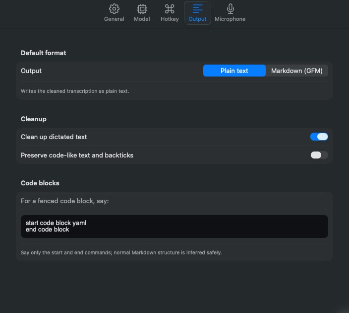
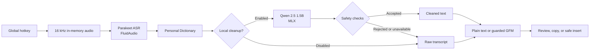

<div align="center">

# Mote

### Voice in. Clean text out. Nothing leaves your Mac.

Mote is a private, on-device dictation app for macOS. Press a key, speak
naturally, and turn your voice into clean text you can review, copy, or insert —
without sending audio or transcripts to a cloud service.

<p>
  <a href="#build-and-launch"></a>
  <a href="#technical-design"></a>
  <a href="#privacy-by-design"></a>
  <a href="#security-and-distribution"></a>
  <a href="LICENSE"></a>
</p>

<p>
  <a href="#how-it-works"><strong>How it works</strong></a> ·
  <a href="#build-and-launch"><strong>Build Mote</strong></a> ·
  <a href="SECURITY.md"><strong>Security posture</strong></a>
</p>



</div>

## Dictation that respects the work

Voice tools are useful because they remove friction. They should not replace
that friction with an account, a subscription, or uncertainty about where your
words went.

Mote keeps the full dictation path on your Apple Silicon Mac. Speech recognition
runs through FluidAudio and Parakeet; a small local model cleans punctuation,
fillers, and false starts through MLX. Deterministic safeguards reject unsafe
rewrites and preserve the raw transcript as the final fallback.

| Local by design | Cleanup with guardrails | Verified delivery |
| --- | --- | --- |
| Audio is processed in memory. Dictation, cleanup, and formatting run on-device. | Local cleanup is accepted only when safety and plausibility checks pass. | Manual review is the default. Optional auto-insert verifies the target and preserves uncertain results for recovery. |

## How it works

1. **Press your hotkey.** Hold **Option-Space** by default, or choose another
   shortcut and switch between hold-to-talk and tap-to-toggle capture.
2. **Speak naturally.** Mote shows lightweight streaming feedback while
   Parakeet produces the final local transcript.
3. **Use the result.** Review the text, choose Plain text or Markdown, then copy
   or insert it. Automatic insertion is available as an opt-in.

No account or API key is required. The first launch asks for Microphone and
Accessibility access and requires explicit approval before downloading the
local transcription and cleanup models.

## Built for real writing workflows

- **Native macOS experience** — a compact menu-bar panel, non-activating
  recording HUD, configurable hotkey, and selectable microphone with a live
  input meter.
- **Conservative local cleanup** — removes fillers and false starts, repairs
  punctuation and capitalization, and falls back to the original transcript
  whenever a candidate is unavailable or unsafe.
- **Plain text or guarded Markdown** — format dictated structure as GitHub-
  Flavored Markdown without allowing the formatter to invent links, prose, or
  unsupported structure.
- **Voice-first code blocks** — say `start code block yaml`, dictate the body,
  and finish with `end code block`; malformed commands remain literal text.
- **Capability-driven text delivery** — verified Accessibility replacement is
  preferred. Privacy-first Unicode events and host-only, ownership-guarded paste
  are available without maintaining brittle per-app patches.
- **Fail-closed recovery** — focus changes and secure fields stop automatic
  insertion. An uncertain attempt is never retried automatically; its transcript
  remains available with an explicit duplication warning.
- **Local working memory** — search History, promote useful results to
  Snippets, and teach the Personal Dictionary names and technical terms.

## Privacy by design

Mote is intentionally small in both permissions and data movement.

| Data or capability | Mote's behavior |
| --- | --- |
| Microphone audio | Held in memory for the current utterance and never written to disk by Mote. |
| Audio and transcripts | Never sent to a remote service by the active dictation path. |
| History and Snippets | Stored as local JSON with owner-only permissions and excluded from device backups; not encrypted at rest. |
| Permissions | Microphone and Accessibility only. No Input Monitoring, Screen Recording, or Full Disk Access. |
| Accounts and telemetry | No account, API keys, analytics, crash-reporting service, or application-controlled transcript upload. |

Model installation is the one setup-time network activity: after you approve
it, supporting libraries download the local ASR and cleanup model artifacts.
See [Security & privacy posture](SECURITY.md) for the complete, auditable
description, including storage and clipboard trade-offs.

## Build and launch

> [!NOTE]
> A Developer ID-signed and Apple-notarized Mote 1.0 build has passed the
> release pipeline. Until a public archive is attached to
> [GitHub Releases](https://github.com/deresolution20/mote/releases), Mote is
> installed from source.

### Requirements

- macOS 26 or later
- Apple Silicon Mac
- Xcode Command Line Tools with Swift 6.3 or later
- Microphone and Accessibility permission

### Build from source

```bash
git clone https://github.com/deresolution20/mote.git
cd mote
./scripts/bundle.sh
open .build/Mote.app
```

On first launch, grant the two requested permissions and review the local model
download. Mote uses Parakeet for speech recognition and
`mlx-community/Qwen2.5-1.5B-Instruct-4bit` for cleanup. Model downloads can be
disabled later without deleting artifacts already cached by their supporting
libraries.

## Technical design

Mote is a native SwiftUI menu-bar application built as a Swift Package. The UI,
audio capture, persistence, cleanup acceptance layer, and output delivery are
separate components so the probabilistic parts of the pipeline remain bounded
by deterministic checks. Mote 1.0 uses the durable bundle identifier
`dev.brice.mote`.



### Safety engineering, not just model inference

- **Raw-first:** Mote retains the ASR transcript and can always resolve to it.
- **Bounded cleanup:** the prompt permits filler removal, false-start repair,
  punctuation, and capitalization — not answering, rewriting, or acting on the
  dictated text.
- **Acceptance checks:** cleanup candidates are screened for semantic drift,
  hallucination, forbidden Markdown, and other unsafe transformations.
- **Guarded formatting:** Markdown must preserve the source words; failed or
  malformed formatting resolves to Plain text.
- **Focus lease:** auto-insert captures process, window, element, and capability
  identity, observes focus changes through transcription, and fails closed if
  observation is unavailable.
- **Secure-target rejection:** secure text fields are never automatic
  destinations.
- **Verified-first insertion:** Mote prefers a settable Accessibility selection,
  verifies caret movement without reading field contents, and uses one selected
  fallback only when no mutation was attempted.
- **No blind retry:** uncertain delivery leaves the transcript pending because a
  second automatic attempt could duplicate sensitive text.

### Project map

| Path | Responsibility |
| --- | --- |
| `Sources/Mote/` | SwiftUI application, capture lifecycle, permissions, persistence, and delivery |
| `Sources/MoteCleanup/` | MLX generation, cleanup acceptance, Markdown safety, and spoken formatting commands |
| `Tests/MoteTests/` | Unit and integration coverage for product behavior and safety boundaries |
| `Tools/Bench/` | Swift benchmark harnesses for local inference and pipeline evaluation |
| `scripts/` | Bundle, sign, notarize, and release scripts plus their shell checks |
| `Resources/` | App entitlements and other bundle resources |
| `docs/` | Decisions, formatting guide, plans and specs, reports, and project history |
| `docs/reports/mlx-cleanup-benchmark/` | Reproducible benchmark evidence and historical model comparisons |

## Development

Run the application checks from the repository root:

```bash
swift test
swift build --product Mote
./scripts/test-product-identity.sh
./scripts/test-bundle-security.sh

cd Tools/Bench
swift test
```

Historical MLX-versus-Ollama reports remain under
[`docs/reports/mlx-cleanup-benchmark/`](docs/reports/mlx-cleanup-benchmark/).
They document the path to the current MLX-only runtime; they are not a
description of Mote's present architecture.

## Security and distribution

Release builds fail closed when the MLX Metal library or a Developer ID
Application identity is unavailable. They enable the hardened runtime, add a
secure timestamp, verify the complete signature, submit to Apple's notary
service, staple the ticket, and run Gatekeeper assessment. The signature embeds
one capability entitlement — microphone audio input — so macOS can present the
standard permission prompt under the hardened runtime.

<details>
<summary><strong>Maintainer: build and notarize a release</strong></summary>

Store notarization credentials in the local Keychain; never add them to the
repository.

```bash
security find-identity -v -p codesigning | grep 'Developer ID Application:'
./scripts/bundle.sh --release

xcrun notarytool store-credentials Mote-notary \
  --apple-id "YOUR_APPLE_ID" \
  --team-id "YOUR_TEAM_ID"

NOTARY_PROFILE=Mote-notary ./scripts/release.sh --notarize
```

Use `SIGNING_IDENTITY="Developer ID Application: Name (TEAMID)"` when more than
one distribution certificate is installed. Use `--archive PATH` to choose a
different output path.

</details>

## Open-source foundation

Mote builds on excellent local-first tooling:

- [FluidAudio](https://github.com/FluidInference/FluidAudio) for on-device
  speech recognition
- [MLX Swift LM](https://github.com/ml-explore/mlx-swift-lm) for Apple Silicon
  language-model inference
- [Swift Hugging Face](https://github.com/huggingface/swift-huggingface) and
  [Swift Transformers](https://github.com/huggingface/swift-transformers) for
  model and tokenizer support

## License

Mote is available under the [MIT License](LICENSE).

<div align="center">

Built with care by [Brice Neal](https://github.com/deresolution20).

</div>
